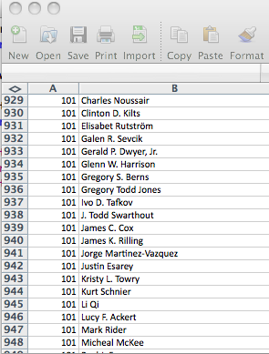

!SLIDE bullets incremental
## Some useful facts about Academics##

* They are, without a doubt, the most important people on the planet (if you don't believe me, ask one)
* It is crucial for others to recognize how important they are
* Since only another academic can comprehend what they do, they need to compare themselves vis-a-vis other academics

!SLIDE bullets incremental
# Which brings me to the first task I was given#
* Create a ranking of Experimental Economics Centers
* Given a list of centers and their researchers
* Rank them by their publications and citations on their publications

!SLIDE center incremental
##The excel file looked like this...##

!SLIDE center incremental
### Okay now what? Google scholar doesn't have an api ###

